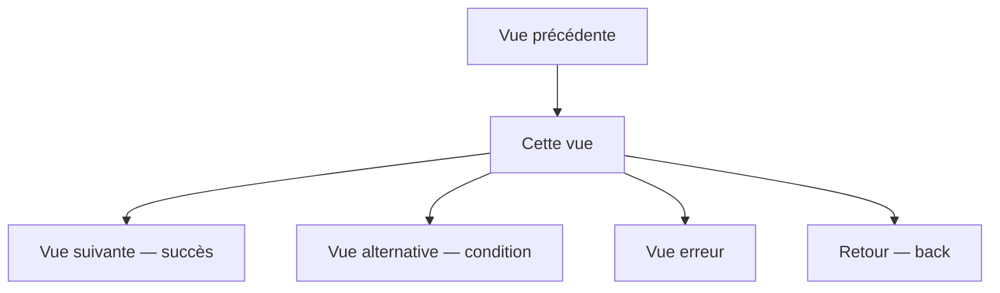

# Skill : new-view

Définit une nouvelle vue de façon exhaustive avant d'écrire la moindre ligne de code.
Produit une user story structurée couvrant besoins, interactions, navigation, états, données et critères d'acceptation.

## Vue à définir
$ARGUMENTS

## Étapes à exécuter dans l'ordre

### 1. Lire le contexte du projet

- Lire `tasks/todo.md` — phase en cours, backlog
- Lire `docs/phases/` — historique des vues déjà définies
- Lire `docs/API.md` si disponible — endpoints existants
- Lire `docs/CONVENTIONS.md` — conventions de nommage et de routing
- Identifier les vues existantes pour cartographier les points d'entrée et de sortie

### 2. Poser les questions de cadrage

Si l'utilisateur n'a pas fourni ces informations, poser ces questions avant de remplir le template :

```
1. Qui est l'utilisateur principal de cette vue ? (persona / rôle)
2. Quel est le déclencheur — d'où vient-il avant d'arriver sur cette vue ?
3. Quelle est l'action principale qu'il doit accomplir ?
4. Où va-t-il ensuite — cas nominal et cas alternatifs ?
5. Des maquettes ou wireframes sont-ils disponibles ?
6. Y a-t-il des contraintes connues (perf, a11y, i18n, permissions) ?
```

Ne pas inventer les réponses. Attendre si nécessaire.

### 3. Remplir le template user story

Utiliser le template `docs/templates/user-story-view.md` comme base.

Créer le fichier : `docs/phases/phase-X.Y-view-<nom-court>-user-story.md`

Remplir **tous** les blocs :
- User story principale (As a / I want / So that)
- Contexte et déclencheur
- Description de la vue
- Éléments UI et interactions
- Enchaînement des vues (diagramme Mermaid **obligatoire**)
- États de la vue (loading, vide, nominal, erreur, offline…)
- Critères d'acceptation Given/When/Then — **minimum 3 scénarios** : nominal, alternatif, erreur
- Données affichées et saisies
- Appels API
- Exigences non fonctionnelles
- Cas limites et hors scope
- Checklist de validation

### 4. Cartographier la navigation

Produire un diagramme Mermaid complet des flux :



Si plusieurs vues sont liées dans la même feature, produire un diagramme de la **séquence complète** (pas juste la vue isolée).

### 5. Identifier les impacts sur les vues existantes

Vérifier si cette nouvelle vue :
- Nécessite un nouveau point d'entrée dans une vue existante (nouveau bouton, nouveau lien)
- Modifie la navigation d'une vue existante (nouvelle sortie)
- Partage des composants avec des vues existantes
- Introduit de nouvelles permissions ou rôles qui affectent d'autres vues

Lister les impacts explicitement — ne pas les ignorer.

### 6. Proposer les décisions techniques liées à la vue

Pour chaque décision structurante (routing, state management, appels API, composants partagés), utiliser le format :

```
Domaine : <Frontend / State / API / Navigation>
Proposition : <ce que je propose>
Pourquoi : <justification courte>
Impact : <ce que ça change, risques>
→ Valider pour continuer ?
```

### 7. Mettre à jour tasks/todo.md

Ajouter dans le backlog :

```markdown
### Vue : [Nom de la vue]
- [ ] User story validée par le PO
- [ ] Maquettes disponibles / layout décrit
- [ ] Critères d'acceptation signés
- [ ] Implémentation composants UI
- [ ] Intégration API
- [ ] Tests unitaires composants
- [ ] Tests E2E parcours nominal
- [ ] Documentation utilisateur
```

### 8. Présenter le résultat à l'utilisateur

Afficher :
1. Le lien vers le fichier user story créé
2. Le diagramme de navigation
3. La liste des impacts sur les vues existantes
4. Les décisions techniques à valider
5. La checklist de validation à compléter

**Attendre la validation explicite de l'utilisateur avant toute implémentation.**

---

## Règles absolues

- Ne jamais remplir les champs avec des placeholders vides (`[à compléter]`) sans explication
- Ne jamais supposer la navigation — si elle n'est pas claire, poser la question
- Le diagramme Mermaid est obligatoire — pas de user story sans flux de navigation
- Les critères d'acceptation doivent couvrir au minimum : nominal, erreur réseau, données invalides
- Zéro ligne de code avant validation de la user story par l'utilisateur

---

> Ce skill s'applique aussi bien à une vue unique qu'à un enchaînement complet de vues (onboarding, tunnel de commande, wizard multi-étapes…).
> Dans ce cas, créer une user story par vue ET un diagramme de séquence global.
