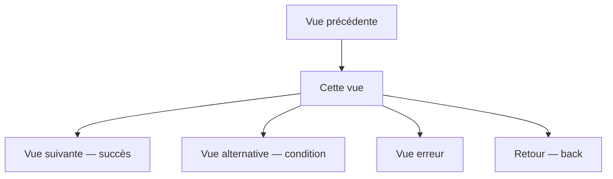

# Skill : new-view

Définit une vue de façon exhaustive — qu'elle soit nouvelle ou déjà implémentée.
Produit une user story structurée couvrant besoins, interactions, navigation, états, données et critères d'acceptation.

Fonctionne en deux modes :
- **Mode création** : vue à implémenter — documente avant d'écrire du code
- **Mode retrofit** : vue existante sans documentation — extrait depuis le code, comble les lacunes, identifie les dettes

## Vue à définir
$ARGUMENTS

## Étapes à exécuter dans l'ordre

### 0. Détecter le mode

Avant tout, déterminer si la vue existe déjà dans le code :
- Chercher dans `src/` (ou équivalent) un composant, une route, un fichier correspondant au nom fourni
- Si un fichier de code correspondant est trouvé → **mode retrofit**
- Si rien n'existe → **mode création**

Annoncer le mode détecté à l'utilisateur :
```
Mode détecté : [Création | Retrofit]
Raison : [aucun fichier trouvé | composant trouvé à src/…]
```

---

## Mode création — vue à implémenter

### 1. Lire le contexte du projet

- Lire `tasks/todo.md` — phase en cours, backlog
- Lire `docs/phases/` — historique des vues déjà définies
- Lire `docs/API.md` si disponible — endpoints existants
- Lire `docs/CONVENTIONS.md` — conventions de nommage et de routing
- Identifier les vues existantes pour cartographier les points d'entrée et de sortie

### 2. Poser les questions de cadrage

Si l'utilisateur n'a pas fourni ces informations, poser ces questions avant de remplir le template :

```
1. Qui est l'utilisateur principal de cette vue ? (persona / rôle)
2. Quel est le déclencheur — d'où vient-il avant d'arriver sur cette vue ?
3. Quelle est l'action principale qu'il doit accomplir ?
4. Où va-t-il ensuite — cas nominal et cas alternatifs ?
5. Des maquettes ou wireframes sont-ils disponibles ?
6. Y a-t-il des contraintes connues (perf, a11y, i18n, permissions) ?
```

Ne pas inventer les réponses. Attendre si nécessaire.

### 3. Remplir le template user story

Utiliser le template `docs/templates/user-story-view.md` comme base.

Créer le fichier : `docs/phases/phase-X.Y-view-<nom-court>-user-story.md`

Remplir **tous** les blocs :
- User story principale (As a / I want / So that)
- Contexte et déclencheur
- Description de la vue
- Éléments UI et interactions
- Enchaînement des vues (diagramme Mermaid **obligatoire**)
- États de la vue (loading, vide, nominal, erreur, offline…)
- Critères d'acceptation Given/When/Then — **minimum 3 scénarios** : nominal, alternatif, erreur
- Données affichées et saisies
- Appels API
- Exigences non fonctionnelles
- Cas limites et hors scope
- Checklist de validation

### 4. Cartographier la navigation

Produire un diagramme Mermaid complet des flux :



Si plusieurs vues sont liées dans la même feature, produire un diagramme de la **séquence complète** (pas juste la vue isolée).

### 5. Identifier les impacts sur les vues existantes

Vérifier si cette nouvelle vue :
- Nécessite un nouveau point d'entrée dans une vue existante (nouveau bouton, nouveau lien)
- Modifie la navigation d'une vue existante (nouvelle sortie)
- Partage des composants avec des vues existantes
- Introduit de nouvelles permissions ou rôles qui affectent d'autres vues

Lister les impacts explicitement — ne pas les ignorer.

### 6. Proposer les décisions techniques liées à la vue

Pour chaque décision structurante (routing, state management, appels API, composants partagés), utiliser le format :

```
Domaine : <Frontend / State / API / Navigation>
Proposition : <ce que je propose>
Pourquoi : <justification courte>
Impact : <ce que ça change, risques>
→ Valider pour continuer ?
```

### 7. Mettre à jour tasks/todo.md

Ajouter dans le backlog :

```markdown
### Vue : [Nom de la vue]
- [ ] User story validée par le PO
- [ ] Maquettes disponibles / layout décrit
- [ ] Critères d'acceptation signés
- [ ] Implémentation composants UI
- [ ] Intégration API
- [ ] Tests unitaires composants
- [ ] Tests E2E parcours nominal
- [ ] Documentation utilisateur
```

### 8. Présenter le résultat à l'utilisateur

Afficher :
1. Le lien vers le fichier user story créé
2. Le diagramme de navigation
3. La liste des impacts sur les vues existantes
4. Les décisions techniques à valider
5. La checklist de validation à compléter

**Attendre la validation explicite de l'utilisateur avant toute implémentation.**

---

## Mode retrofit — vue existante sans documentation

### R1. Lire le code existant

Explorer le projet pour trouver tous les fichiers liés à cette vue :
- Composant(s) principal(aux) : template/JSX, styles, logique
- Fichier de routing : identifier la route, les paramètres, les guards
- Appels API : fetch, axios, queries, mutations
- State management : store, context, hooks locaux
- Composants enfants réutilisés
- Tests existants (si présents)

Lister les fichiers trouvés avant de continuer.

### R2. Extraire ce qui existe

Remplir le template `docs/templates/user-story-view.md` en déduisant depuis le code.

Pour chaque section, indiquer la source de l'information :
- `[extrait du code]` — comportement clairement lisible dans le code
- `[inféré]` — comportement probable mais non explicite, à confirmer
- `[manquant]` — absent du code, comportement inconnu

Sections à remplir depuis le code :
- Éléments UI et interactions → déduire des composants et handlers
- Navigation entrante/sortante → déduire du router et des `navigate()` / `<Link>`
- Appels API → déduire des endpoints appelés et des payloads
- États gérés → chercher les états loading/error/empty dans le code
- Données affichées → déduire des props et des mappings dans le template

### R3. Identifier les lacunes

Après extraction, produire un rapport de lacunes structuré :

```
## Lacunes identifiées

### Comportements non documentés (inférés depuis le code)
- [comportement X] — à confirmer avec le PO
- …

### États manquants dans l'implémentation
- [ ] État vide non géré — que doit-on afficher si la liste est vide ?
- [ ] Erreur réseau non gérée — aucun fallback trouvé
- …

### Critères d'acceptation manquants
- Aucun test trouvé pour [scénario X]
- …

### Champs du template non renseignables depuis le code seul
- Persona / bénéfice attendu → nécessite input PO
- Cas limites → à valider
- …
```

### R4. Poser les questions ciblées

Ne poser que les questions nécessaires pour combler les lacunes identifiées en R3.
Ne pas re-demander ce qui est déjà extrait du code.

```
Pour compléter la documentation de [nom de la vue], j'ai besoin de :

1. [Question ciblée sur un comportement inféré]
2. [Question sur un état manquant]
3. …
```

### R5. Compléter et finaliser le template

Avec les réponses obtenues, compléter les sections marquées `[inféré]` ou `[manquant]`.
Créer le fichier : `docs/phases/phase-X.Y-view-<nom-court>-user-story.md`

### R6. Produire le rapport de dette

Après finalisation du template, produire une section dette :

```markdown
## Dette documentaire & technique identifiée

### Documentation
- [ ] User story inexistante avant ce retrofit — créée rétrospectivement

### Implémentation
- [ ] [État X] non géré dans le code → à implémenter (ticket #XX)
- [ ] [Validation Y] absente → risque de régression (ticket #XX)
- [ ] Aucun test pour [scénario Z] → à ajouter (ticket #XX)
```

Ajouter ces items dans `tasks/todo.md` sous la section dette.

### R7. Présenter le résultat à l'utilisateur

Afficher :
1. Les fichiers de code analysés
2. Le fichier user story créé
3. Le diagramme de navigation extrait
4. Le rapport de lacunes et de dette
5. Les questions restantes si applicable

**Ne pas modifier le code existant sans validation explicite.**

---

## Règles absolues

- Détecter le mode (création vs retrofit) **avant toute autre action**
- Ne jamais remplir les champs avec des placeholders vides (`[à compléter]`) sans explication
- En mode retrofit : toujours marquer la source de chaque information (`[extrait du code]`, `[inféré]`, `[manquant]`)
- Ne jamais supposer la navigation — si elle n'est pas claire, poser la question
- Le diagramme Mermaid est obligatoire — pas de user story sans flux de navigation
- Les critères d'acceptation doivent couvrir au minimum : nominal, erreur réseau, données invalides
- Mode création : zéro ligne de code avant validation de la user story
- Mode retrofit : zéro modification du code existant avant validation explicite

---

> Ce skill s'applique aussi bien à une vue unique qu'à un enchaînement complet de vues (onboarding, tunnel de commande, wizard multi-étapes…).
> Dans ce cas, créer une user story par vue ET un diagramme de séquence global.
