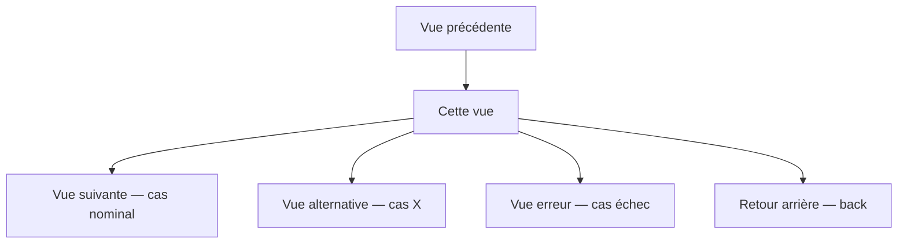

# User Story — Vue : [Nom de la vue]

**Feature** : [Nom de la feature parente]
**Phase** : X.Y
**Statut** : Draft | En révision | Validée
**Date** : YYYY-MM-DD
**Auteur** : [Nom]

---

## 1. User Story principale

```
En tant que [persona — qui est l'utilisateur ?],
je veux [action principale — qu'est-ce qu'il fait sur cette vue ?],
afin de [bénéfice attendu — pourquoi ça lui est utile ?].
```

> Si plusieurs profils utilisateurs accèdent à cette vue avec des usages différents, répéter ce bloc pour chaque profil.

---

## 2. Contexte & déclencheur

| Champ | Valeur |
|-------|--------|
| **Point d'entrée** | Comment l'utilisateur arrive sur cette vue (lien, bouton, deeplink, redirect post-action…) |
| **Prérequis** | Ce qui doit être vrai avant d'arriver ici (authentifié, données chargées, permission X…) |
| **Déclencheur** | L'action ou l'événement qui initie la navigation vers cette vue |
| **Route / URL** | `/path/:param` — route attendue (si applicable) |

---

## 3. Description de la vue

> En 3 à 5 phrases, décrire ce que l'utilisateur voit et fait sur cette vue. Pas de jargon technique.

---

## 4. Éléments UI & interactions

Liste exhaustive des composants visibles et des actions possibles.

### 4.1 Composants

| Composant | Type | Description | Obligatoire ? |
|-----------|------|-------------|---------------|
| [Titre de page] | Texte | Ex : "Mes commandes" | Oui |
| [Bouton principal] | CTA | Action principale de la vue | Oui |
| [Liste d'items] | Liste scrollable | Affiche X éléments avec pagination | Non |
| [Filtre / Recherche] | Input | Filtre les résultats en temps réel | Non |
| … | … | … | … |

### 4.2 Actions utilisateur

| Action | Déclencheur | Résultat attendu |
|--------|-------------|------------------|
| Cliquer sur [bouton X] | Tap / Click | Navigation vers [vue Y] |
| Soumettre le formulaire | Tap "Valider" | Appel API → feedback visuel → redirect |
| Swipe gauche sur un item | Gesture | Affiche actions contextuelles |
| … | … | … |

---

## 5. Enchaînement des vues & navigation

> Diagramme des flux possibles depuis et vers cette vue.



### 5.1 Navigation sortante

| Action | Destination | Condition |
|--------|-------------|-----------|
| Cliquer [bouton principal] | `/route-suivante` | Toujours |
| Valider le formulaire | `/confirmation` | Si succès API |
| Cliquer [lien secondaire] | `/autre-vue` | Toujours |
| Appuyer sur retour / back | [Vue précédente] | Si historique disponible |

### 5.2 Navigation entrante

| Depuis | Via | Données transmises |
|--------|-----|--------------------|
| [Vue X] | Bouton "Voir détail" | `id`, `type` |
| [Email] | Deeplink | `token` |
| [Vue Y] | Redirect post-action | `status=success` |

---

## 6. États de la vue

Chaque vue doit gérer l'ensemble des états ci-dessous. Décrire le comportement attendu pour chacun.

| État | Déclencheur | Ce que l'utilisateur voit |
|------|-------------|--------------------------|
| **Chargement** | Requête en cours | Skeleton / spinner — aucune interaction possible |
| **Vide** | Aucune donnée disponible | Message d'état vide + CTA pour créer/ajouter |
| **Nominal** | Données chargées avec succès | Vue complète, toutes interactions disponibles |
| **Erreur réseau** | Timeout / 5xx | Message d'erreur + bouton "Réessayer" |
| **Erreur métier** | 4xx / règle métier | Message explicite + action corrective |
| **Partiellement chargé** | Données partielles | Afficher ce qui est disponible, indiquer le reste |
| **Offline** | Pas de connexion | Données en cache si disponibles, sinon message |

---

## 7. Critères d'acceptation

Format **Given / When / Then** — un scénario par comportement à tester.

### Scénario nominal

```gherkin
Given [contexte initial — état de l'app, données disponibles, utilisateur connecté…]
When  [action de l'utilisateur]
Then  [résultat attendu visible pour l'utilisateur]
 And  [effet de bord éventuel — navigation, mise à jour, email envoyé…]
```

### Scénarios alternatifs

```gherkin
Given [contexte — cas alternatif]
When  [même action ou action différente]
Then  [résultat différent]
```

### Cas d'erreur

```gherkin
Given [contexte — conditions d'échec]
When  [action utilisateur]
Then  [message d'erreur affiché]
 And  [aucune navigation — l'utilisateur reste sur la vue]
```

> Répéter autant de blocs que nécessaire. Chaque critère d'acceptation devient un cas de test dans le cahier de tests.

---

## 8. Données

### 8.1 Données affichées

| Champ | Source | Format | Obligatoire | Valeur par défaut |
|-------|--------|--------|-------------|-------------------|
| [Nom utilisateur] | `user.name` | String | Oui | — |
| [Date de commande] | `order.createdAt` | DD/MM/YYYY | Oui | — |
| [Statut] | `order.status` | Enum : pending / active / done | Oui | — |
| … | … | … | … | … |

### 8.2 Données saisies (si formulaire)

| Champ | Type | Validation | Message d'erreur |
|-------|------|------------|------------------|
| [Email] | Input text | Format email valide, obligatoire | "Email invalide" |
| [Montant] | Input number | > 0, ≤ 10 000 | "Montant hors limites" |
| … | … | … | … |

### 8.3 Appels API

| Opération | Méthode | Endpoint | Paramètres | Réponse attendue |
|-----------|---------|----------|------------|-----------------|
| Charger les données | GET | `/api/v1/resource` | `id`, `page` | `200 { data[], total }` |
| Soumettre | POST | `/api/v1/resource` | body JSON | `201 { id }` |

---

## 9. Exigences non fonctionnelles

| Critère | Cible | Notes |
|---------|-------|-------|
| **Performance** | TTI < 2s, FCP < 1s | Paginer si liste > 20 items |
| **Accessibilité** | WCAG 2.1 AA | Labels aria, navigation clavier, contraste ≥ 4.5:1 |
| **Responsive** | Mobile-first, breakpoints S / M / L | Décrire les différences de layout si besoin |
| **Internationalisation** | [Oui / Non] | Tous les textes via i18n si oui |
| **Sécurité** | Inputs sanitisés, données sensibles masquées | |

---

## 10. Cas limites & hors scope

### Cas limites à traiter

- [ ] Liste très longue (> 1 000 items) → comportement de la pagination
- [ ] Texte très long dans [champ X] → truncature + tooltip
- [ ] Utilisateur sans permission pour une action → bouton désactivé ou masqué + message
- [ ] Double soumission rapide → debounce / désactivation du bouton pendant l'appel
- [ ] Session expirée pendant la saisie → redirect vers login avec retour préservé

### Hors scope (explicitement exclu de cette vue)

- [ ] [Fonctionnalité X] → traitée dans la vue [Y] ou phase [Z]
- [ ] [Cas d'usage Y] → non prioritaire, ticket #XX

---

## 11. Maquettes & références visuelles

> Joindre les liens Figma, captures d'écran, ou décrire le layout si pas de maquette.

- [ ] Maquette desktop : [lien Figma]
- [ ] Maquette mobile : [lien Figma]
- [ ] Design system utilisé : [lien / nom]
- [ ] Composants existants réutilisés : [liste]

---

## 12. Dépendances & risques

| Type | Description | Impact | Mitigation |
|------|-------------|--------|------------|
| Dépendance | API [X] pas encore disponible | Bloquant | Utiliser un mock |
| Risque | Performances de la liste sur mobile | Élevé | Virtualisation si > 50 items |
| Dette | Composant [Y] à refactoriser avant réutilisation | Moyen | Inclure dans cette phase |

---

## Checklist de validation (avant implémentation)

- [ ] User story relue et validée par le PO
- [ ] Tous les états de vue décrits
- [ ] Navigation entrante et sortante complète
- [ ] Critères d'acceptation couvrent les cas nominaux, alternatifs et d'erreur
- [ ] Données et appels API identifiés
- [ ] Maquettes disponibles ou layout décrit
- [ ] Cas limites identifiés
- [ ] Hors scope défini explicitement
